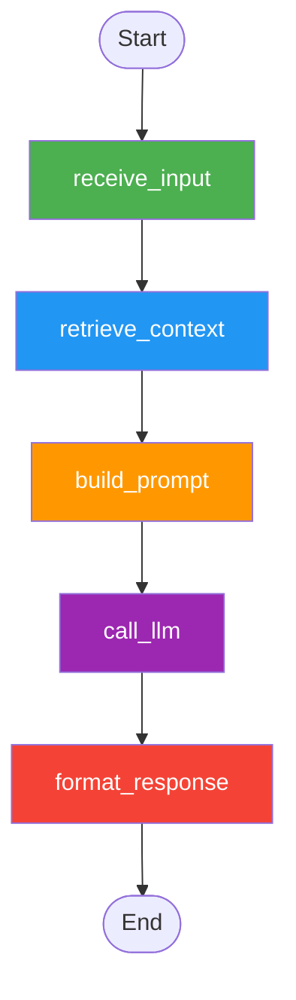
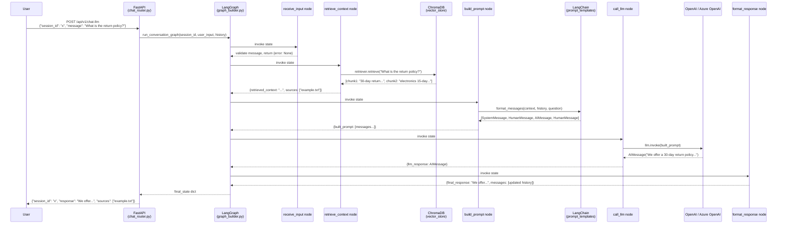

# LLM Chatbot Backend — Complete Educational Guide

> **Audience:** Developers with basic Python knowledge who want to understand how to build production-grade AI chatbot backends.

---

## 1. What is a Large Language Model (LLM)?

### The Simple Explanation

Imagine you hired someone who had read every book, article, and website on the internet by 2024. When you ask them a question, they don't look anything up — they answer from memory. That person is an LLM.

An LLM (Large Language Model) is a type of AI trained on massive amounts of text data. Given some text as input, it predicts what text should come next — character by character, word by word.

### Key Concepts

**Tokens**

LLMs don't process whole words — they process "tokens", which are pieces of words.
- `"hello"` = 1 token
- `"unbelievable"` = 3 tokens (`un`, `believ`, `able`)
- On average, 1 token ≈ 0.75 English words

Why does this matter? Because LLMs charge by the token, and have token limits.

**Context Window**

The context window is how much text the LLM can "see" at once — like its working memory.
- GPT-4o has a 128,000 token context window (~100,000 words — about a whole novel)
- Everything inside the context window is what the LLM uses to generate its response
- Text outside the window is forgotten

Think of it like a conversation on a whiteboard: the whiteboard only has so much space. Old messages get erased to make room for new ones.

**Temperature**

Temperature controls how "creative" or "random" the LLM is:
- `0.0` = Always picks the most likely next token → deterministic, factual, repetitive
- `0.7` = Balances creativity and accuracy → good for general chat
- `1.5` = Very creative, often weird or inaccurate → good for creative writing

In this project: `LLM_TEMPERATURE=0.7` (configurable in `.env`).

---

## 2. What is LangChain and Why Do We Need It?

### The Problem

Calling OpenAI directly looks like this:

```python
import openai
client = openai.OpenAI()
response = client.chat.completions.create(
    model="gpt-4o",
    messages=[{"role": "user", "content": "Hello"}]
)
```

This works for simple one-shot calls. But a real chatbot needs:
- Prompt templates that fill in variables
- Memory of previous messages
- Chains of multiple LLM calls
- Switching between OpenAI and Azure OpenAI without code changes

### LangChain = LEGO Bricks for AI

LangChain provides standardised building blocks that snap together:

```
PromptTemplate → LLM → OutputParser → Memory → Chain
```

Each block has a standard interface, so you can swap pieces without rewriting everything. Want to switch from OpenAI to Azure? Change one line in `config.py`.

### What We Use LangChain For in This Project

| LangChain Feature | Where Used | Purpose |
|---|---|---|
| `ChatOpenAI` / `AzureChatOpenAI` | `llm/llm_provider.py` | Creates the LLM client |
| `ChatPromptTemplate` | `llm/prompt_templates.py` | Builds prompts with variables |
| `MessagesPlaceholder` | `llm/prompt_templates.py` | Injects chat history into prompts |
| `HumanMessage`, `AIMessage` | `graph/nodes.py` | Typed message objects |

---

## 3. What is LangGraph and Why Do We Need It?

### The Problem with Simple Chains

LangChain chains are linear: A → B → C. But real conversations are stateful:
- "What's the weather?" → Answer about weather
- "What about tomorrow?" → LLM must remember the previous topic was weather
- "Should I bring an umbrella?" → Still needs that context

A chain processes one request at a time with no memory between turns. LangGraph adds **state** that persists across nodes.

### LangGraph = A Stateful Flowchart

LangGraph models conversation as a **graph** of nodes:
- Each **node** is a Python function that does one job
- Each **edge** connects nodes in sequence
- **State** (a TypedDict) flows through all nodes and carries all data

### This Project's Conversation Graph



**Node responsibilities:**
1. `receive_input` — Validates the user's message, sets error if empty
2. `retrieve_context` — Queries ChromaDB for relevant document chunks
3. `build_prompt` — Assembles the LLM prompt using LangChain templates
4. `call_llm` — Sends the prompt to OpenAI/Azure and gets the response
5. `format_response` — Cleans the response, appends to conversation history

### State TypedDict

```python
class ConversationState(TypedDict):
    session_id: str          # Which conversation is this?
    messages: list[dict]     # Full history (used for multi-turn memory)
    user_input: str          # User's latest message
    retrieved_context: str   # Chunks from ChromaDB
    sources: list[str]       # Source file names for citations
    final_response: str      # Bot's final answer
    error: Optional[str]     # Any error that occurred
```

The state starts partially filled and each node adds more data until `format_response` produces `final_response`.

---

## 4. What is RAG (Retrieval-Augmented Generation)?

### The Problem RAG Solves

**Problem 1: Hallucination**
LLMs sometimes confidently state wrong facts. They "hallucinate" because they generate plausible-sounding text, not necessarily true text.

**Problem 2: No Private Data**
The LLM was trained on public internet data until its cutoff date. It knows nothing about:
- Your company's internal documents
- Your product's specific policies
- Data created after its training cutoff

**Solution: RAG**
Instead of asking "what do you know about our return policy?", we:
1. Search our own documents for the answer
2. Give the LLM the relevant text as context
3. Ask the LLM to answer based only on that context

### Step-by-Step RAG Flow

```
INDEXING PHASE (run once):
─────────────────────────
📄 Documents (.txt, .pdf)
         │
         ▼
✂️  Split into chunks (512 tokens each, 50 overlap)
         │
         ▼
🔢 Generate embedding vector for each chunk
   (OpenAI text-embedding-ada-002)
         │
         ▼
💾 Store vectors + text in ChromaDB

QUERY PHASE (every request):
─────────────────────────────
❓ User question: "What is the return policy?"
         │
         ▼
🔢 Convert question to embedding vector
         │
         ▼
🔍 Find top-3 most similar vectors in ChromaDB
   (cosine similarity search)
         │
         ▼
📄 Return matching text chunks as "context"
         │
         ▼
📝 Build prompt: "Given this context: [chunks], answer: [question]"
         │
         ▼
🤖 LLM generates answer based on the provided context
         │
         ▼
💬 Response + source citations returned to user
```

---

## 5. What is LlamaIndex and What Role Does It Play?

### LlamaIndex = The Document Pipeline

LlamaIndex handles the complex parts of the RAG indexing flow so you don't have to build them from scratch:

**Document Loaders**
`SimpleDirectoryReader` reads .txt, .pdf, .md, .docx files and converts them into LlamaIndex `Document` objects with metadata (file name, creation date, etc.).

**Node Parsers (Chunkers)**
`SentenceSplitter` splits large documents into chunks:
- Tries to split at sentence boundaries (not mid-word)
- `chunk_size=512`: each chunk is max 512 tokens
- `chunk_overlap=50`: consecutive chunks share 50 tokens to preserve context at boundaries

**The Index Abstraction**
`VectorStoreIndex` is the high-level object that ties everything together:
- `from_documents()`: reads, chunks, embeds, and stores documents
- `from_vector_store()`: connects to existing ChromaDB data without re-embedding
- `.as_retriever()`: creates a retriever object for querying

**In This Project:**
- `document_loader.py` uses `SimpleDirectoryReader` + `SentenceSplitter` + `VectorStoreIndex.from_documents()`
- `vector_store.py` uses `VectorStoreIndex.from_vector_store()` to reconnect to existing data
- `retriever.py` uses `.as_retriever().retrieve(query)` to search ChromaDB

---

## 6. What is ChromaDB?

### Vector Databases vs Traditional Databases

| Traditional Database (SQLite, Postgres) | Vector Database (ChromaDB) |
|---|---|
| Stores: text, numbers, dates | Stores: embedding vectors (arrays of floats) |
| Queries: exact match, WHERE clauses | Queries: "find most similar vectors" |
| Example: `WHERE name = 'Alice'` | Example: "find chunks similar to this question" |
| Fast for structured lookups | Fast for semantic similarity search |

### What is an Embedding Vector?

An embedding is a list of ~1500 floating point numbers that represents the "meaning" of a piece of text.

```python
"return policy" → [0.023, -0.145, 0.891, 0.002, ..., -0.334]  # 1536 numbers
"refund rules"  → [0.025, -0.143, 0.887, 0.001, ..., -0.330]  # Very similar numbers!
"recipe for cake" → [-0.5, 0.8, -0.2, 0.9, ..., 0.1]          # Very different numbers
```

Words with similar meanings have similar vectors — this is what makes semantic search work.

### Cosine Similarity in Plain English

Cosine similarity measures how similar two vectors are, returning a value from -1 to 1:
- `1.0` = identical meaning
- `0.0` = completely unrelated
- `-1.0` = opposite meaning

Think of vectors as arrows pointing in a space with 1536 dimensions. Cosine similarity measures the angle between two arrows:
- Same direction (small angle) = similar meaning = high score
- Perpendicular (90°) = unrelated = 0
- Opposite direction (180°) = opposite meaning = -1

ChromaDB uses cosine similarity to rank chunks by relevance to your query.

---

## 7. How This Project's Components Fit Together

### End-to-End Flow Diagram



---

## 8. How to Run Locally (Step-by-Step)

### Prerequisites

- Python 3.11+
- Docker Desktop (for docker-compose)
- An OpenAI API key (from platform.openai.com) OR an Azure OpenAI resource

### Step 1: Clone and Set Up Environment

```bash
cd llm-chatbot-backend
cp .env.example .env
```

### Step 2: Edit .env

Open `.env` and fill in your API key:

```bash
# For standard OpenAI:
LLM_PROVIDER=openai
OPENAI_API_KEY=sk-your-real-key-here

# For Azure OpenAI:
# LLM_PROVIDER=azure
# AZURE_OPENAI_API_KEY=your-azure-key
# AZURE_OPENAI_ENDPOINT=https://your-resource.openai.azure.com/
# AZURE_OPENAI_DEPLOYMENT_NAME=gpt-4o
```

### Step 3: Install Dependencies (without Docker)

```bash
python -m venv venv
source venv/bin/activate       # Windows: venv\Scripts\activate
pip install -r requirements.txt
```

### Step 4: Run the Server

```bash
uvicorn app.main:app --reload --port 8000
```

The server starts at `http://localhost:8000`. Visit `http://localhost:8000/docs` for the interactive API explorer (Swagger UI).

### Step 5: Index the Sample Documents

```bash
curl -X POST http://localhost:8000/api/v1/index \
  -H "Content-Type: application/json" \
  -d '{"directory": "./data/sample_docs"}'
```

Expected response:
```json
{"indexed": 1, "message": "Successfully indexed 1 document(s) from './data/sample_docs'"}
```

### Step 6: Chat with the Bot

```bash
curl -X POST http://localhost:8000/api/v1/chat-llm \
  -H "Content-Type: application/json" \
  -d '{"session_id": "my-session-1", "message": "What is the return policy?"}'
```

Expected response:
```json
{
  "session_id": "my-session-1",
  "response": "Based on the policy document, we offer a 30-day return policy...",
  "sources": ["example.txt"]
}
```

### Using Docker Compose (Recommended)

```bash
# Build and start both the chatbot and ChromaDB services
docker-compose up --build

# The API is now at http://localhost:8000
# ChromaDB admin UI is at http://localhost:8001

# Stop everything
docker-compose down
```

### Running Tests

```bash
pytest tests/ -v

# Run with coverage report
pip install pytest-cov
pytest tests/ -v --cov=app --cov-report=term-missing
```

---

## 9. How to Deploy to Azure (Step-by-Step)

### Prerequisites

- Azure account (free tier works for testing)
- [Azure Developer CLI (azd)](https://learn.microsoft.com/en-us/azure/developer/azure-developer-cli/install-azd) installed
- [Azure CLI](https://docs.microsoft.com/en-us/cli/azure/install-azure-cli) installed
- Docker Desktop running

### Step 1: Login to Azure

```bash
# Login to Azure Developer CLI (opens browser)
azd auth login

# Login to Azure CLI (for Bicep deployment)
az login
```

### Step 2: Initialize azd in Your Project

```bash
cd llm-chatbot-backend
azd init
```

This creates an `.azure/` folder with your environment configuration.

### Step 3: Set Environment Variables

```bash
# Set your OpenAI key as an azd environment variable (stored securely)
azd env set OPENAI_API_KEY "sk-your-key-here"
azd env set LLM_PROVIDER "openai"
```

### Step 4: Deploy Everything

```bash
azd up
```

This single command:
1. Provisions Azure resources (Container Apps, ACR, Log Analytics) using Bicep
2. Builds your Docker image
3. Pushes the image to Azure Container Registry
4. Deploys the container to Azure Container Apps
5. Outputs the public URL of your deployed API

This takes approximately 5-10 minutes on the first run.

### Step 5: Test Your Deployed API

```bash
# azd up outputs the URL — use it here
curl https://YOUR-APP.azurecontainerapps.io/api/v1/health
```

### What Each Azure Resource Does

| Resource | Purpose |
|---|---|
| **Azure Container Apps** | Runs your Docker container. Auto-scales, handles HTTPS, manages deployments. |
| **Azure Container Registry (ACR)** | Stores your Docker images. Container Apps pulls from here. |
| **Log Analytics Workspace** | Collects all logs from your container. View in Azure Portal → Monitor. |
| **Managed Identity** | Allows Container Apps to pull from ACR without passwords. |

### Viewing Logs on Azure

```bash
# Stream live logs
azd logs

# Or in Azure Portal:
# Azure Container Apps → Your App → Monitoring → Log stream
```

---

## 10. Glossary

| Term | Definition |
|---|---|
| **Token** | The smallest unit of text an LLM processes. Roughly 0.75 words. LLMs are billed per token and have token limits. |
| **Embedding** | A list of floating point numbers (a vector) that represents the "meaning" of a piece of text. Similar texts have similar embeddings. Generated by models like `text-embedding-ada-002`. |
| **Vector** | A mathematical array of numbers. In AI, vectors represent meaning. ChromaDB stores and compares vectors. |
| **Cosine Similarity** | A score from -1 to 1 measuring how similar two vectors are. Score of 1 = identical meaning, 0 = unrelated, -1 = opposite meaning. Used by ChromaDB to rank search results. |
| **Chunk** | A small piece of a larger document. Documents are split into chunks so relevant parts (not the whole document) can be sent to the LLM. |
| **Context Window** | The maximum amount of text an LLM can process in one call. GPT-4o supports 128,000 tokens. Text outside the context window is ignored. |
| **Temperature** | A number (0.0–2.0) controlling LLM randomness. 0 = always picks the most likely word (deterministic). 2.0 = very random and creative. |
| **Top-K** | How many document chunks to retrieve from ChromaDB per query. Higher K = more context for the LLM but higher token costs. |
| **Hallucination** | When an LLM confidently states something false. LLMs predict likely text, not necessarily true text. RAG reduces hallucination by giving the LLM authoritative source text. |
| **Agent** | An LLM with the ability to use tools (search the web, run code, call APIs) and decide which tool to use based on the task. More advanced than a simple chatbot. |
| **Node** | In LangGraph, a node is a Python function that processes the conversation state. Each node does one job (validate, retrieve, call LLM, etc.). |
| **Edge** | In LangGraph, an edge is a connection between two nodes that defines the flow. `add_edge(A, B)` means "after A finishes, always go to B". |
| **Graph** | In LangGraph, the full conversation pipeline represented as a directed graph (nodes + edges). LangGraph's StateGraph manages execution. |
